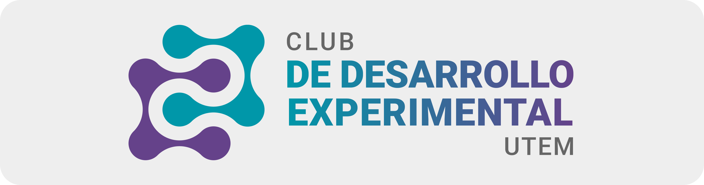

# Taller Node js + Mongo db

## Descripcion

Este taller tiene como objetivo crear una **API REST** con Node js y Mongo db, para ello se utilizara el framework Express js y el ORM Mongoose.
este taller esta dirigido a integrantes del Club de Desarrollo Experimental de la Universidad Tecnologica Metropolitana

## contenido del curso

- Introduccion a Node js y Mongo db
- crear una api con express js
- crear un modelos con mongoose
- login con jwt y google oauth
- crear un crud con express js y mongoose

## Requisitos

- tener instalado node js y tener cuenta en mongo db atlas
- tener instalado postman
- tener instalado git
- tener instalado visual studio code

## Instalacion

- clonar el repositorio
- ejecutar el comando `npm install` para instalar las dependencias
- crear un archivo `.env` en la raiz del proyecto y agregar las variables de entorno
- ejecutar el comando `npm run dev` para iniciar el servidor

> [!NOTA]
> este taller es solo para fines educativos, no se recomienda utilizar en produccion
